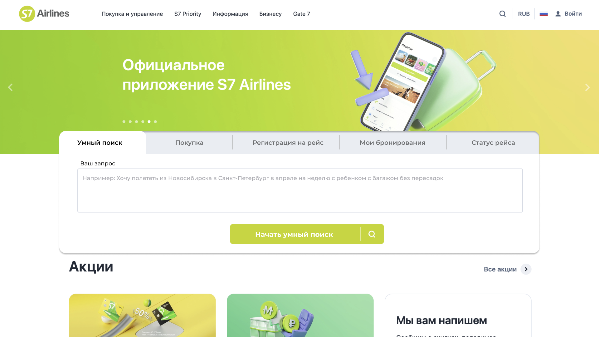
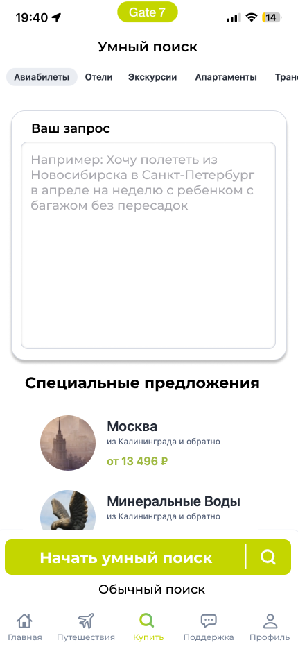

# Аналитические артефакты и описание проекта
## 1) Основные объекты продукта
>Продукт 1: ai-помощник в покупке билет

   

## Процесс взаимодействия с системой

### 1. **Пользователь (Клиент)**
- Вводит запрос через интерфейс, например, на ПК или мобильном устройстве.
- Запрос передается в **AI-помощника** для обработки.

### 2. **AI-помощник**
- AI-помощник анализирует запрос пользователя, извлекает ключевые параметры (например, дата, место, предпочтения по питанию и багажу) и передает запрос на поиск в **векторную базу данных** и **базу данных** для получения информации.

### 3. **Векторная база данных и база данных**
- **Векторная база данных** использует гибридный поиск, который сочетает обработку запросов и машинное обучение для выдачи наиболее релевантных вариантов.
- **База данных** хранит информацию о рейсах, ценах, услугах и других данных для дальнейшего анализа и обработки.

### 4. **Модуль расчета**
- После того как данные о рейсах и предложениях были получены, **модуль расчета** отвечает за вычисление стоимости билетов, скидок и других услуг.
- Например, может рассчитывать скидку по субсидиям или привилегиям.

### 5. **Выдача информации**
- После расчета и обработки информации, система предоставляет пользователю список доступных вариантов, которые он может просмотреть и выбрать. Это может быть как список предложений рейсов, так и дополнительные услуги, такие как питание и багаж.

### 6. **Бронирование и покупка**
- Когда пользователь выбирает вариант, он может перейти к покупке билета, и процесс завершается оформлением заказа.

---

>Продукт 2: ai-система оптимизации трансфертных маршрутов

   

## Процесс взаимодействия с системой

### 1. Обращение клиента
- Клиент делает обращение в систему, указывая свою проблему (например, потеря стыковки).

### 2. AI чат-бот
- AI чат-бот обрабатывает запрос и запрашивает информацию по пересадке (например, время, пассажиры, аэропорт и доступные варианты).
- Он также использует данные из базы данных для уточнения маршрутов и решений.

### 3. Передача сведений
- Информация о ситуации передается в систему для дальнейшей обработки.

### 4. Модуль приоритезации
- Модуль приоритезации определяет, какие пассажиры получают более приоритетные маршруты на основе бизнес-логики, например, статус пассажира или наличие лояльности.

### 5. Вариант компенсации
- На основе всех данных система предоставляет вариант компенсации (например, ваучеры, отель или другие бонусы).

### 6. Решение
- Система принимает решение, какие действия предпринять и какой маршрут или компенсацию предложить пассажиру.

### 7. Реакция
- Пассажир реагирует на предложение: если он согласен, процесс завершается, если нет — подключается служба поддержки.

### 8. Поддержка
- Если решение не устраивает пассажира, подключается служба поддержки для дальнейшей помощи.

## 2) Ролевая модель

>Продукт 1: ai-помощник в покупке билет

| Роль                          | Описание                                                                                                                                          |
|-------------------------------|---------------------------------------------------------------------------------------------------------------------------------------------------|
| Пользователь (клиент)          | задаёт параметры поиска в свободной форме, получает предложения маршрутов, уточняет детали, оформляет покупку                                      |
| ai-помощник                    | обрабатывает ввод пользователя, извлекает ключевые параметры, обращается к базам данных и выдает подходящие варианты                               |
| Модуль профилирования          | анализирует историю клиента (частота поездок, предпочтения, возраст, статус) и адаптирует предложения                                            |
| Модуль расчета тарифа          | рассчитывает стоимость билета с учетом субсидий, скидок, багажа, питания, предпочтений                                                          |
| Служба поддержки (fallback)    | подключается при невозможности ai предложить корректный маршрут или при возникновении сложных вопросов                                           |
| Продуктовый аналитик           | отслеживает поведение пользователей, анализирует слабые места в цепочке принятия решений, задаёт гипотезы для улучшения бота                     |
| Data Scientist / ML инженер    | обучает и обновляет модель, поддерживает работу рекомендательной логики                                                                         |

---
>Продукт 2: ai-система оптимизации трансфертных маршрутов

| Роль                            | Описание                                                                                                                                  |
|---------------------------------|-------------------------------------------------------------------------------------------------------------------------------------------|
| Пассажир                        | получает уведомление о потере стыковки, взаимодействует с предложенными вариантами пересадки, выбирает лучший для себя или запрашивает помощь |
| Система ai-оптимизации          | анализирует текущие задержки, загруженность рейсов, оценивает стоимость компенсаций и предлагает оптимальные маршруты                     |
| Модуль приоритезации            | принимает решение о том, какие пассажиры получают более приоритетные маршруты на основе бизнес-логики (статус, лояльность, класс и т.п.) |
| Модуль компенсаций              | рассчитывает стоимость ваучеров, отелей, питания, бонусов и сопоставляет с альтернативами                                                |
| Представитель авиакомпании (оператор) | следит за работой системы, может вручную скорректировать маршруты, если ai не учел критичные нюансы (например, vip-пассажиры)         |
| Служба поддержки                | помогает пассажирам, если они не удовлетворены автоматическими решениями                                                                  |
| Менеджер по качеству сервиса    | анализирует эффективность предложений, собирает фидбэк, инициирует улучшения алгоритма                                                     |

## 3) Пользовательские/Функциональные/Нефункциональные требования
>Продукт 1: ai-помощник в покупке билет

### Пользовательские требования
- пользователь вводит простую фразу типа “хочу в Москву 12 апреля утром” — помощник сам уточняет и выдает готовые опции
- помощник “помнит” прошлые предпочтения и предлагает подходящие билеты (питание, багаж, молодежная субсидия)
- помощник отображает цену с учетом статуса пользователя, скидок, бонусов

### Функциональные требования
- модель для обработки естественного языка
- генерация sql-запросов к БД S7 через LLM
- подключение к базе пользователя (лояльность, прошлые поездки, возраст, регион)
- алгоритм подбора оптимального маршрута (время, цена, условия)
- расчет конечной цены с учетом субсидий, опций и пользовательского статуса

### Нефункциональные требования
- быстрый отклик (не более 2 сек между сообщениями)
- доступность 24/7 с резервным сервером
- интерфейс в виде мобильного приложения и web-версии
- соблюдение требований по защите персональных данных
- масштабируемость — возможность адаптировать под разные языки и регионы

---
>Продукт 2: ai-система оптимизации трансфертных маршрутов

### Пользовательские требования
- пассажир, потерявший стыковку, получает предложение нового маршрута в течение 5 минут
- система предлагает варианты с учетом минимального ожидания, компенсаций и личных параметров (статус лояльности, наличие багажа, цели поездки)
- при задержке пассажиру автоматически приходят предложения по бонусам (еда, отель, мили)
- пассажир может выбрать предложенный маршрут или запросить альтернативу через интерфейс/бота

### Функциональные требования
- интеграция с системой бронирования и контроля рейсов (отслеживание опозданий, занятости рейсов)
- модуль расчета стоимости компенсаций и альтернативных маршрутов
- приоритезация пассажиров по заранее обученной модели (loyalty, бизнес-класс, молодежная субсидия и т.д.)
- генерация маршрутов с учетом рейсов своей и сторонних авиакомпаний
- система рекомендаций по стимулированию (например, предложить ваучер + ожидание 5 часов против моментального вылета другой авиакомпанией)

### Нефункциональные требования
- отклик системы не более 5 секунд при критических пересадках
- масштабируемость (обработка тысячи кейсов одновременно)
- объясняемость решений (AI должен уметь обосновать выбор варианта)
- устойчивость к сбоям (резервная логика при потере связи с базой рейсов)
- защита персональных данных в соответствии с GDPR и локальным законодательством

   
## 4) Прототипы интерфейса
### Возможности интерфейса

Интерфейс нашего продукта включает несколько экранных форм, каждая из которых выполняет конкретные задачи для пользователей. Все формы имеют интуитивно понятный дизайн и адаптированы под ПК и мобильные устройства.

### 1. Умный поиск (ПК версия)
**Цель:** поиск и бронирование билетов на основе запросов пользователя.

   

### Как взаимодействует пользователь:
- Пользователь вводит запрос в свободной форме (например, "хочу лететь в Москву 12 апреля утром с ручной кладью и халяльным питанием").
- Нейросеть анализирует запрос, извлекает все ключевые параметры и пожелания (время, место, багаж, питание, субсидии и т.д.) и предлагает оптимальные варианты билетов.
- Отображаются варианты рейсов, стоимость и доступные услуги, которые были указаны в запросе.

**Функции:**
- Анализ запроса.
- Генерация персонализированных предложений на основе всех пожеланий пользователя.

### 2. Умный поиск (мобильная версия)
**Цель:** тот же функционал, что и на ПК, адаптированный для мобильных устройств.

   

### Как взаимодействует пользователь:
- Пользователь вводит запрос на мобильном устройстве, указывая все пожелания (например, "хочу в Москву с детьми, без пересадок, с багажом и субсидией для молодежи").
- Нейросеть обрабатывает запрос, учитывая все введённые пожелания, и предлагает оптимальные рейсы и услуги.
- Дизайн адаптирован для удобной навигации, с возможностью быстрого бронирования и уведомлениями для подтверждения.

**Функции:**
- Автоматическая обработка запросов с учётом всех пожеланий.
- Предоставление персонализированных предложений.

## 3. Предложения и подтверждения
**Цель:** отображение предложенных вариантов и подтверждение бронирования.

### Как взаимодействует пользователь:
- Пользователь выбирает рейс или отель, подтверждает условия и стоимость, включая все указанные в запросе дополнительные услуги.
- Далее отображается экран с возможностью выбора дополнительных опций (если они не были указаны в запросе) или для изменения текущих настроек.

**Функции:**
- Подтверждение выбора.
- Изменение в заказе.
- Отображение итоговой стоимости и услуг.

## Взаимодействие с интерфейсом

- **Пользователи (клиенты):** вводят запросы в свободной форме, включая все пожелания и дополнительные услуги (например, питание, багаж, субсидии), которые система обрабатывает и предлагает оптимальные варианты.
- **AI-помощник:** обрабатывает запросы, извлекает ключевые параметры и генерирует персонализированные предложения на основе всех пожеланий.
- **Служба поддержки:** подключается, если нейросеть не может предложить подходящий вариант или возникают проблемы в процессе.
- **Продуктовый аналитик:** отслеживает поведение пользователей, собирает статистику и помогает улучшать рекомендации и функциональность.

## 5) Перспективы расширения системы

 >Продукт 1: ai-помощник в покупке билета

- **Интеграция с погодными сервисами:** система может рекомендовать маршруты с учетом погоды в день вылета, например, чтобы избежать плохих погодных условий в аэропорте.
- **Использование предсказательной аналитики:** модель может предсказывать и предлагать пользователю наиболее вероятные даты путешествий на основе его предыдущих предпочтений и данных о сезонных трендах.
- **Алгоритмы машинного обучения:** внедрение алгоритмов, которые будут не только анализировать запросы пользователя, но и предугадывать их предпочтения, основываясь на истории покупок, погодных условиях и событиях в месте назначения (например, мероприятия, фестивали).
- **Интерфейс для бизнес-пользователей:** введение дополнительных функций для мониторинга и оптимизации затрат компании на перелеты.
- **Поддержка нескольких языков:** система будет поддерживать несколько языков помимо русского.
- **Голосовой ввод и/или общение с голосовым ассистентом:** добавление функции голосового ввода и общения с голосовым ассистентом в реальном времени.

>Продукт 2: ai-система оптимизации трансфертных маршрутов

- **Механизм мотивации пассажиров:** внедрение предложений, чтобы пассажиры согласились на более длинные пересадки или длительное ожидание рейса (например, бонусные баллы или скидки на будущие рейсы).
- **Интеграция с системой смс-сообщений и звонков клиентам:** после принятия решения о пересадке и компенсации, клиенту будет направлено сообщение и/или звонок с информацией.
- **Расширение критериев приоритезации посадки:** система будет учитывать дополнительные критерии при приоритезации посадки на рейсы, основываясь на политике компании.

